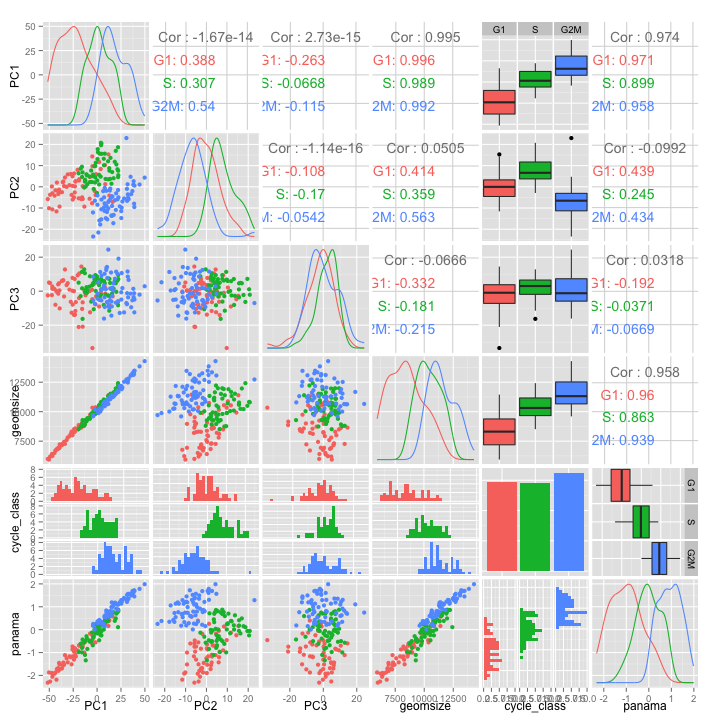

---
output:
knitrBootstrap::bootstrap_document:
title: Response to Buettner, Natarajan "Computational analysis of cell-to-cell heterogeneity in single-cell RNA-sequencing data reveals hidden subpopulations of cells"
author: 
- Andrew McDavid
- Greg Finak
- Raphael Gottardo
- Fred Hutchinson Cancer Research Center
date:  "29 December, 2015"
keep_md: yes
---
<!-- using knitrBootstrap::knit_bootstrap -->


## Loading mESC data
We first load the expression data that the authors provide in the paper, although note that the final gene in the mESC data set contained corrupted data in the file included in the Nature supplement.   John Marioni kindly provided us with a version that fixed that corruption, which is what is being used here.

We also load the list of cell cycle genes, and an estimate of the Panama (scLVM) latent variable.  In the remainder of this document we refer to this variable as just the panama latent variable, since that is what BNC are doing in the python code provided.

```r
## Supplementary table 1, sheet 1
ccgenes <- read.xls('data/cell_cycle_genes.xlsx', as.is=TRUE, header=F)$V1
## converted from excel .xlsx, Supplementary Data 2, fixing a corrupted character in final column.
##These are Log10(ercc_normalized_counts+1).
uncorr <- fread('data/mesc_cell_cycle_uncorrected.csv')
## Generated from above using authors' code from https://github.com/PMBio/scLVM
Xpanama <- scan('data/ES_X_ARD_1.txt')
mesc <- as.matrix(uncorr[,-1,with=FALSE])
## using totals of each phase listed in paper
mescCdat <- data.frame(cycle_class=factor(c(rep("G1",59),  rep("S", 58),  rep("G2M",65)), levels=c('G1', 'S', 'G2M')), idx=seq_len(nrow(mesc)), panama=Xpanama, geomsizeUncorr=rowSums(mesc))
```

We'll also need a crosswalk between the gene symbols and ensembl ids provided in `ccgenes`:

```r
eg <- as.data.table(as.data.frame(org.Mm.egSYMBOL2EG))
setkey(eg, gene_id)
ensembleg <- as.data.table(as.data.frame(org.Mm.egENSEMBL))
setkey(ensembleg, gene_id)
fdat <- ensembleg[eg,,nomatch=0]
setkey(fdat, symbol)
```

Now join with symbols provided.  Some symbols map to multiple ensembl ids--we'll just take the first one listed.
We define the **Ranked** set of genes to be genes with cell cycle annotation, which BNC used to calculate the scLVM factor.  The **Unranked** set of genes are all others.

```r
mescFdat <- fdat[colnames(mesc),,mult='first']
mescFdat <- mescFdat[,ccRanked:=factor((ensembl_id %in% ccgenes), labels=c('FALSE'='Unranked', 'TRUE'='Ranked'))]
mescFdatDup <- fdat[colnames(mesc)]
```
This affects 63 records.

## Loading mouse T-cell data
We repeat the process as above.

```r
## Supplementary Data 1, sheet 1
T_cell_raw <- fread("data/T_cell_uncorrected.csv")
## sheet 2
T_cell_corrected <- fread("data/T_cell_corrected.csv") 
setnames(T_cell_raw, "V1", "cell_id")
setnames(T_cell_corrected, "V1", "cell_id")
## Supplementary Data 1, sheet 3
cluster <- fread("data/T_cell_cluster.csv")
setnames(cluster, 'Gata3HighCLuster', 'clusterid')
cluster <- cluster[,clusterid:=factor(clusterid)]
## Again, we generated using authors' code from https://github.com/PMBio/scLVM
lv_factor <- scan("data/X_ARD_1.txt")
```

Two gene symbols are duplicated, we'll just take the first one listed.

```r
T_cell_matrix <- as.matrix(T_cell_raw[,-1,with=FALSE])
T_cell_matrix_corrected <- as.matrix(T_cell_corrected[,-1,with=FALSE])
# Remove duplicated gene names (only 2)
T_cell_matrix <- T_cell_matrix[,unique(colnames(T_cell_matrix))]
T_cell_matrix_corrected <- T_cell_matrix_corrected[,unique(colnames(T_cell_matrix_corrected))]
stopifnot(all(colnames(T_cell_matrix_corrected)==colnames(T_cell_matrix)))

TcellCdat <- data.frame(cluster, panama=lv_factor, geomsizeUncorr=rowSums(T_cell_matrix))
```
Again, we'll need to map symbols to ensembl.

```r
TcellFdat <- fdat[colnames(T_cell_matrix),,mult='first']
TcellFdat <- TcellFdat[,ccRanked:=factor((ensembl_id %in% ccgenes), labels=c('FALSE'='Unranked', 'TRUE'='Ranked'))]
TcellFdatDup <- fdat[colnames(T_cell_matrix)]
```

There are 182 cells and 9571 genes in the mESC data and
81 cells and 7071 genes in the T-cell data.


## $R^2$ attributable to Cell Cycle in mESC
First, we explore how much of the variance in the mESC data set can be explained by cell cycle.

Below, we define the $R^2$ as a ratio of linear model deviances (sums of squares) in a full and null model.

```r
lrTestLM <- function(Fit, drop){
    nFit <- update(Fit, as.formula(paste0('. ~ . -', drop)))
    lambda <- (deviance(nFit)-deviance(Fit))
    nDF <- (Fit$rank-nFit$rank)
    data.frame(lambda=lambda, P=1-pchisq(lambda, nDF), pctDev=pmin(lambda/deviance(nFit)*100))
    }
```
This function just compares the residual squared error with and without the factor `drop` (in our case, this will always be cell cycle), and calculates this change (`lambda`) and its ratio over the null deviance as a percentage.

BNC offer an adjustment in their variance decompositions for a factor that reflects technical variability.  We didn't attempt to replicate their calculation of this factor.  Below we compare the unadjusted values to some benchmark values from their paper and find reasonable agreement nonetheless, suggesting that these findings are robust to adjustment for putative sources of technical variability.

We consider regressions of `cycle_class` on the uncorrected log expression values.

```r
afit <- lm(mesc~cycle_class, data=mescCdat)
atest <- lrTestLM(afit, 'cycle_class')
P <- atest$P 
pctDev <- atest$pctDev
lambda <- atest$lambda
devModels <- data.table(model='cycle_class', symbol=colnames(coef(afit)), P, lambda, pctDev)
setkey(devModels, symbol)
setkey(mescFdat, symbol) 
devModels <- devModels[mescFdat,,allow.cartesian=TRUE]
```
We have joined the linear model results to the gene annotation data here.

Next, we report the variance estimates in median/90% gene in ranked/unranked sets, which gives the following result:

```r
devSum <- devModels[,{ 
    Q <- quantile(pctDev, prob=c(.5, .9), na.rm=TRUE)
    list('50%'=Q[1], '90%'=Q[2], Ngenes=.N)
}, keyby=list(ccRanked)]

knitr::kable(devSum)
```


|ccRanked |      50%|      90%| Ngenes|
|:--------|--------:|--------:|------:|
|Unranked | 3.479555| 15.15740|   8995|
|Ranked   | 7.992946| 27.02797|    608|

### Comparing to Supplementary Figure 4b
We sought to compare our estimate to a description of these quantities in the paper.  We located an estimate of the effect of cell cycle by reading numbers off of figures S4b/S4d.

From this figure, fewer than 22% (1-7638/9571) of genes have >10% of variance attributable to cell cycle via "gold standard" including both ranked and unranked genes.
We reproduce the rest of the numbers from reading the gene counts annotated above the box plots.
Although this ignores the difference between ranked/unranked genes, we see that  BNC's result lies somewhere between the results for ranked/unranked genes.

```r
## right endpoints of R^2 bins
R2 <- c(0, 10, 20, 30, 40, 50, 90)
## number of genes in bin
counts <- c(0, 7638, 1079, 483, 225, 97, 49)
## number of genes in bin and all bins below
countsBelow <- cumsum(counts)
figureData <- data.frame(R2, countsBelow, pctBelow=countsBelow/max(countsBelow), source='From Figure S4b')
```


```r
ggplot()+stat_ecdf(data=devModels, mapping=aes(x=pctDev, col=ccRanked)) +geom_line(data=figureData, mapping=aes(x=R2, y=pctBelow, col=source)) + xlab('% R^2 due to cell cycle') + ylab('Cumulative Distribution') + scale_color_discrete("Source") + theme(legend.position=c(.7, .3)) + geom_abline(aes(intercept=c(.5, .9), slope=0), lty=2)
```

 
*Figure 1: Cell cycle variability estimates*

#### Remark
Since there is no manifest variable that explains the "technical" variance that BNC subtract in their calculations, we think that it makes more sense to consider the undeflated estimates, since these represent the gene expression values that experimenters must use in practice, until a factor can be identified as a manifest variable for the technical variability.

## PCA
### PCA On Uncorrected mESC
PCA on all genes shows that the geometric size `geomsize` is principal component 1, explaining 9%-29% of the variance.

```r
getPCA <- function(exprMat, cData, scale.=FALSE){
    pcOut <- prcomp(exprMat, scale.=scale.)
    geomsize <- rowSums(exprMat)
    pcall <- data.frame(pcOut$x[,1:3], geomsize, cData)
    varExp <- pcOut$sdev^2/sum(pcOut$sdev^2)
    list(pcPairs=pcall, varianceExplained=varExp)
}

mescPca <- getPCA(mesc, mescCdat[,c('cycle_class', 'panama')])
```

We see that PC1 one is highly correlated with geometric size (`geomsize`) and the `panama` factor that we estimated.
We also observe that the cell cycle phase of a cell is correlated with `geomsize`/PC1 and discuss that point at greater length below.

```r
ggpairs(mescPca$pcPairs, color='cycle_class')
```

 

*Figure 2: PCA and geometric library size in mESC experiment*

### PCA on Uncorrected Tcells
In the Tcells, we again see that PC1 one is highly correlated with geometric size (`geomsize`) and the `panama`  factor.

```r
tcpca <- getPCA(T_cell_matrix, TcellCdat[,c('panama', 'clusterid')])
ggpairs(tcpca$pcPairs, columns=c(1:5), color='clusterid')
```

 

*Figure 3: PCA and geometric library size in Tcell experiment*


## Percentage variance due to PC1

```r
varExplained <- data.frame('data set'=c('mESC', 'T-cell'),
                           'PC1 Variance Explained'=c(mescPca$varianceExplained[1],
                               tcpca$varianceExplained[1]), check.names=F)
knitr::kable(varExplained) 
```


|data set | PC1 Variance Explained|
|:--------|----------------------:|
|mESC     |              0.0892713|
|T-cell   |              0.2895370|
*Table 1: PCA PC1 variance explained*

### Remark on T-cell clustering
The T-cell clustering reported in the corrected T-cell data appears to depend substantially on the dimension reduction method used.  We are unable to replicate the clustering in the corrected or uncorrected data using linear PCA, or non-linear t-stochastic neighborhood embedding.  As the exact software version and parameters BNC used for the 'non-linear PCA' were not provided, we didn't attempt to apply that algorithm.

Using ordinary PCA, we found instead that the GATA3 `cluster` variable corresponds roughly to a half-space defined by PC2, but since multiple modes are not evident, we would not detect distinct clusters, but rather a gradient of cells.

```r
tcCorrectedPCA <- getPCA(T_cell_matrix_corrected, TcellCdat[,c('panama', 'clusterid')])
qp <- ggplot(data = tcCorrectedPCA$pcPairs, aes(x = PC1, y = PC2)) + geom_density2d(color = "black",show_guide=FALSE) + geom_point(data = tcCorrectedPCA$pcPairs, aes(size = geomsize, color = clusterid))+scale_color_discrete("cluster id")+scale_size_continuous("geometric size")
qp1 <- qp + ggtitle('PCA Corrected')
qp2 <- qp %+% tcpca$pcPairs + ggtitle('PCA Uncorrected')
grid.arrange(qp1, qp2)
```

 

*Figure 4: Looking for clusters in Tcells using PCA on corrected and uncorrected data*

We also try to do the same using `t-SNE` as implemented in the `Rtsne` package, which is a non-linear dimension reduction technique, which has been successfully applied to single-cell data.

The figures above (PCA) and below (t-SNE) do now show any obvious clustering of the cells either before or after correction according to the clusters reported in BNC. An obvious grouping of the cells by geomsize is present.

```r
#exact tsne, set theta=0
tsne <- data.frame(tsne=Rtsne(T_cell_matrix, dims = 2, initial_dims = 50, perplexity = 20, theta = 0.0, check_duplicates = TRUE, pca = TRUE)$Y, geomsize=rowSums(T_cell_matrix))

tsneCorr <- data.frame(tsne=Rtsne(T_cell_matrix_corrected, dims = 2, perplexity = 20, theta = 0.0, check_duplicates = TRUE, pca = TRUE)$Y, geomsize=rowSums(T_cell_matrix_corrected)) 
qptsne <- qplot(data=cbind(tsne, TcellCdat), x=tsne.1, y=tsne.2, col=clusterid)+geom_density2d(aes(group=1),col="black",show_guide=FALSE)+geom_point(aes(size=geomsize))+scale_color_discrete("cluster id")+scale_size_continuous("geometric size")
qp3 <- qptsne %+% cbind(tsneCorr, TcellCdat) + ggtitle('TSNE Corrected')
qp4 <- qptsne + ggtitle('TSNE Uncorrected')
grid.arrange(qp3, qp4)
```

 

*Figure 5: Looking for clusters in Tcells using t-SNE on corrected and uncorrected data*


## Relationship between `geomsize`, `panama` and cell cycle
From the plots of the PCA in mESC, we observe that average geometric size and average panama factor both depend on the cell cycle.  Here we formally consider how much variance cell cycle explains in these factors by comparing the $R^2$ due to cell cycle on `panama` versus the $R^2$ due to geometric size, within each cell cycle.

```r
models <- c('panama ~ cycle_class', 'panama ~ geomsizeUncorr', 'panama ~ geomsizeUncorr', 'panama ~ geomsizeUncorr')
Subset <- list('all'=c('G1', 'S', 'G2M'), G1='G1', S='S', G2M='G2M')
R2 <- sapply(seq_along(models), function(i){
    l <- lm(as.formula(models[i]), data=mescCdat, subset=cycle_class %in% Subset[[i]])
    summary(l)$r.squared
})

knitr::kable(data.frame(Model=models, 'R^2' = R2, Subset=names(Subset), check.names=FALSE), row.names=FALSE)
```


|Model                   |       R^2|Subset |
|:-----------------------|---------:|:------|
|panama ~ cycle_class    | 0.6479790|all    |
|panama ~ geomsizeUncorr | 0.9217106|G1     |
|panama ~ geomsizeUncorr | 0.7447921|S      |
|panama ~ geomsizeUncorr | 0.8824271|G2M    |
*Table 2: dependence of panama factor on cell cycle and geometric size*

### Comparison of discrimant power of `geomsize` and `panama`
The comparison can also be inverted.  Using proportional odds logistic regression to classify cells by their geometric size and/or panama factor, we find modestly better performance using `panama`.  In both cases, the error rate exceeds 25%.  The S phase cells are especially resistant to classification.

```r
## scale geomsize to prevent unfriendly numerics
pgeom <- polr(cycle_class ~ scale(geomsizeUncorr), data=mescCdat)
ppanama <- update(pgeom, . ~  panama)
tgeom <- table(predict(pgeom), mescCdat$cycle_class)
tpanama <- table(predict(ppanama), mescCdat$cycle_class)
```
`geomsize` has a error rate of 0.3736264 and confusion matrix:

```r
knitr::kable(tgeom)
```


|    | G1|  S| G2M|
|:---|--:|--:|---:|
|G1  | 44| 11|   0|
|S   | 12| 28|  23|
|G2M |  3| 19|  42|
*Table 3: cell cycle classification using geometric size*


`panama` has a error rate of 0.2912088 and confusion matrix:

```r
knitr::kable(tpanama)
```


|    | G1|  S| G2M|
|:---|--:|--:|---:|
|G1  | 46| 12|   0|
|S   | 12| 33|  15|
|G2M |  1| 13|  50|
*Table 4: cell cycle classification using panama*


The heavy dependence of `panama` on geometric size means that the classificiation power of panama relies on geometric size being a reasonable instrument for cell cycle, which is an assumption that has not been thoroughly tested.

## Gene Set Enrichment Analysis using Corrected Data
To conclude our analysis, we investigated if the scLVM factor would be successful in eliminating cell cycle signal when testing for differences between the T-cell clusters.

We considered gene set enrichment analysis on the corrected T-cell data.

```r
eSet <- ExpressionSet(t(T_cell_matrix_corrected))
pData(eSet) <- TcellCdat
```
We used the Broad Institute's "Reactome" module available here: http://www.broadinstitute.org/gsea/msigdb/collections.jsp.

```r
c2_set <- getGmt("data/c2.cp.reactome.v4.0.symbols.gmt")
gene_ids <- geneIds(c2_set)
## # Camera requires gene-indices
design <- model.matrix(~clusterid, eSet)
sets_indices <- ids2indices(gene_ids, toupper(rownames(eSet))) 
res <- camera(eSet, sets_indices, design=design)
```


```r
res$Direction <- ifelse(res$Direction=='Up', 1, -1)
res$set <- row.names(res)
setDT(res)
setkey(res, FDR) 
res <- res[,':='(totalrank=rank(PValue))]
resFDR <- res[FDR<.05,]
nFDR <- nrow(resFDR)
```
In the 34 modules with a FDR-q value 5% or less, a substantial number relate to cell cycle.

Among the top 20 modules, there is little suggestion of enrichment for immue-related modules.  Many modules relate to cell cycle.

```r
knitr::kable(resFDR[1:20,list(Direction, FDR, totalrank, set)])  
```


| Direction|       FDR| totalrank|set                                                                                      |
|---------:|---------:|---------:|:----------------------------------------------------------------------------------------|
|        -1| 0.0000036|         1|REACTOME_MITOTIC_PROMETAPHASE                                                            |
|        -1| 0.0000153|         2|REACTOME_E2F_MEDIATED_REGULATION_OF_DNA_REPLICATION                                      |
|        -1| 0.0000346|         3|REACTOME_DEPOSITION_OF_NEW_CENPA_CONTAINING_NUCLEOSOMES_AT_THE_CENTROMERE                |
|        -1| 0.0000346|         4|REACTOME_G2_M_CHECKPOINTS                                                                |
|        -1| 0.0000951|         5|REACTOME_G1_S_SPECIFIC_TRANSCRIPTION                                                     |
|        -1| 0.0002130|         6|REACTOME_CELL_CYCLE                                                                      |
|        -1| 0.0002834|         7|REACTOME_CHROMOSOME_MAINTENANCE                                                          |
|        -1| 0.0015164|         8|REACTOME_ACTIVATION_OF_ATR_IN_RESPONSE_TO_REPLICATION_STRESS                             |
|        -1| 0.0015164|         9|REACTOME_DNA_REPLICATION                                                                 |
|        -1| 0.0015164|        10|REACTOME_CELL_CYCLE_MITOTIC                                                              |
|        -1| 0.0015164|        11|REACTOME_KINESINS                                                                        |
|        -1| 0.0015164|        12|REACTOME_MITOTIC_M_M_G1_PHASES                                                           |
|        -1| 0.0018450|        13|REACTOME_DOUBLE_STRAND_BREAK_REPAIR                                                      |
|        -1| 0.0020784|        14|REACTOME_CYCLIN_A_B1_ASSOCIATED_EVENTS_DURING_G2_M_TRANSITION                            |
|        -1| 0.0032273|        15|REACTOME_G2_M_DNA_DAMAGE_CHECKPOINT                                                      |
|        -1| 0.0037052|        16|REACTOME_FANCONI_ANEMIA_PATHWAY                                                          |
|        -1| 0.0037108|        17|REACTOME_ACTIVATION_OF_THE_PRE_REPLICATIVE_COMPLEX                                       |
|        -1| 0.0048701|        18|REACTOME_HOMOLOGOUS_RECOMBINATION_REPAIR_OF_REPLICATION_INDEPENDENT_DOUBLE_STRAND_BREAKS |
|        -1| 0.0061528|        19|REACTOME_APC_CDC20_MEDIATED_DEGRADATION_OF_NEK2A                                         |
|        -1| 0.0089812|        20|REACTOME_E2F_ENABLED_INHIBITION_OF_PRE_REPLICATION_COMPLEX_FORMATION                     |
*Table 5: gene set enrichment analysis using reactome modules on T cell clusters*

The same is true when using the GO Biological Process modules. All 20 top modules are directly or indirectly (DNA repair or DNA replication) cell-cycle associated.


```r
c5_set <- getGmt("data/c5.bp.v4.0.symbols.gmt")
gene_ids <- geneIds(c5_set)
## # Camera requires gene-indices
design <- model.matrix(~clusterid, eSet)
sets_indices <- ids2indices(gene_ids, toupper(rownames(eSet))) 
res <- camera(eSet, sets_indices, design=design)
```


```r
res$Direction <- ifelse(res$Direction=='Up', 1, -1)
res$set <- row.names(res)
setDT(res)
setkey(res, FDR) 
res <- res[,':='(totalrank=rank(PValue))]
resFDR <- res[FDR<.05,] 
nFDR <- nrow(resFDR)
```


```r
knitr::kable(resFDR[1:20,list(Direction, FDR, totalrank, set)])  
```


| Direction|       FDR| totalrank|set                                  |
|---------:|---------:|---------:|:------------------------------------|
|        -1| 0.0000001|         1|CELL_CYCLE_PROCESS                   |
|        -1| 0.0000002|         2|CELL_CYCLE_PHASE                     |
|        -1| 0.0000008|         3|M_PHASE                              |
|        -1| 0.0000008|         4|MITOSIS                              |
|        -1| 0.0000009|         5|MITOTIC_CELL_CYCLE                   |
|        -1| 0.0000009|         6|SISTER_CHROMATID_SEGREGATION         |
|        -1| 0.0000011|         7|MITOTIC_SISTER_CHROMATID_SEGREGATION |
|        -1| 0.0000012|         8|M_PHASE_OF_MITOTIC_CELL_CYCLE        |
|        -1| 0.0000056|         9|CELL_CYCLE_GO_0007049                |
|        -1| 0.0000150|        10|CHROMOSOME_SEGREGATION               |
|        -1| 0.0000225|        11|CELL_CYCLE_CHECKPOINT_GO_0000075     |
|        -1| 0.0000385|        12|CYTOKINESIS                          |
|        -1| 0.0000452|        13|REGULATION_OF_MITOSIS                |
|        -1| 0.0001653|        14|CELL_DIVISION                        |
|        -1| 0.0002503|        15|DNA_DEPENDENT_DNA_REPLICATION        |
|        -1| 0.0004236|        16|CHROMOSOME_CONDENSATION              |
|        -1| 0.0011016|        17|MITOTIC_CELL_CYCLE_CHECKPOINT        |
|        -1| 0.0018225|        18|DNA_REPLICATION                      |
|        -1| 0.0032980|        19|DNA_INTEGRITY_CHECKPOINT             |
|        -1| 0.0057410|        20|DNA_REPLICATION_INITIATION           |
*Table 6: gene set enrichment analysis using GO-biological process modules on T cell clusters*


## Session Info
This report was generated using

```r
sessionInfo()
```

```
## R version 3.2.2 (2015-08-14)
## Platform: x86_64-apple-darwin13.4.0 (64-bit)
## Running under: OS X 10.10.5 (Yosemite)
## 
## locale:
## [1] en_US.UTF-8/en_US.UTF-8/en_US.UTF-8/C/en_US.UTF-8/en_US.UTF-8
## 
## attached base packages:
## [1] parallel  stats4    stats     graphics  grDevices utils     datasets 
## [8] methods   base     
## 
## other attached packages:
##  [1] reshape2_1.4.1       MASS_7.3-43          Rtsne_0.10          
##  [4] stringr_1.0.0        GSEABase_1.32.0      graph_1.48.0        
##  [7] annotate_1.48.0      XML_3.98-1.3         limma_3.26.3        
## [10] BiocInstaller_1.20.1 org.Mm.eg.db_3.2.3   RSQLite_1.0.0       
## [13] DBI_0.3.1            AnnotationDbi_1.32.0 IRanges_2.4.4       
## [16] S4Vectors_0.8.3      Biobase_2.30.0       BiocGenerics_0.16.1 
## [19] gridExtra_2.0.0      gdata_2.17.0         GGally_0.5.0        
## [22] ggplot2_1.0.1        data.table_1.9.6     markdown_0.7.7      
## [25] knitr_1.11           devtools_1.9.1      
## 
## loaded via a namespace (and not attached):
##  [1] Rcpp_0.12.2      highr_0.5.1      formatR_1.2.1    plyr_1.8.3      
##  [5] tools_3.2.2      digest_0.6.8     evaluate_0.8     memoise_0.2.1   
##  [9] gtable_0.1.2     proto_0.3-10     gtools_3.5.0     grid_3.2.2      
## [13] reshape_0.8.5    magrittr_1.5     codetools_0.2-14 scales_0.3.0    
## [17] xtable_1.8-0     colorspace_1.2-6 labeling_0.3     stringi_1.0-1   
## [21] munsell_0.4.2    chron_2.3-47
```
